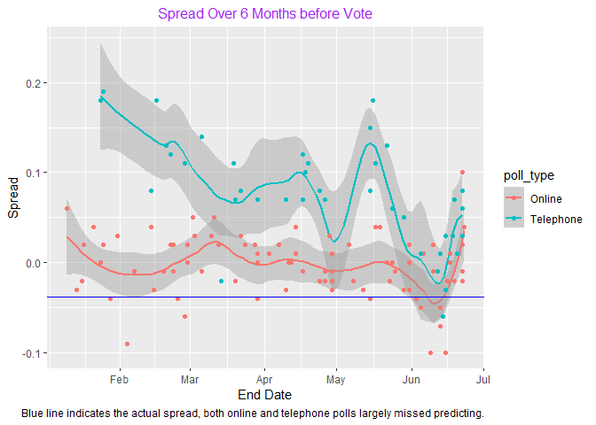

Brexit Poll Data Analysis (plot included)
================
Can Li
2021-01-29

#### **Overview**

  - In June 2016, the United Kingdom (UK) held a referendum to determine
    whether the country would “Remain” in the European Union (EU) or
    “Leave” the EU. This referendum is commonly known as Brexit.
    Although the media and others interpreted poll results as
    forecasting “Remain” ( p\>0.5, p indicating the proportion voted
    “Remain”) , the actual proportion that voted “Remain” was only
    48.1% (p=0.481) and the UK thus voted to leave the EU. Pollsters in
    the UK were criticized for overestimating support for “Remain”.

  - This is a report on polling data *brexit\_polls* from the *dslabs*
    package, which contains actual polling data for the 6 months before
    the Brexit vote. I develop polling models to forecast Brexit
    results. The code in R generate plots.

#### **I used the following libraries:**

``` r
library(tidyverse)
library(dslabs)
```

#### **and the following dataset:**

``` r
data("brexit_polls")
```

#### **Here we can see the first 5 rows of polling data:**

  - Variables include raw proportions of voters preferring “Remain”,
    “Leave”, and “Undecided”

  - The spread is the *difference* in the raw proportion of voters
    choosing “Remain” and the raw proportion choosing “Leave”.

<!-- end list -->

    ##    startdate    enddate   pollster poll_type samplesize remain leave undecided
    ## 1 2016-05-14 2016-05-16 Ipsos MORI Telephone       1002   0.55  0.37      0.05
    ## 2 2016-05-11 2016-05-15        ORB Telephone        800   0.55  0.40      0.05
    ## 3 2016-02-13 2016-02-16 Ipsos MORI Telephone        497   0.54  0.36      0.10
    ## 4 2016-01-23 2016-01-25 Ipsos MORI Telephone        513   0.55  0.36      0.09
    ## 5 2016-01-22 2016-01-24     ComRes Telephone       1006   0.54  0.36      0.10
    ##   spread
    ## 1   0.18
    ## 2   0.15
    ## 3   0.18
    ## 4   0.19
    ## 5   0.18

#### **Here is the plot I generated:**


